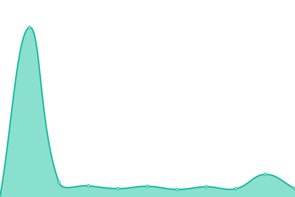
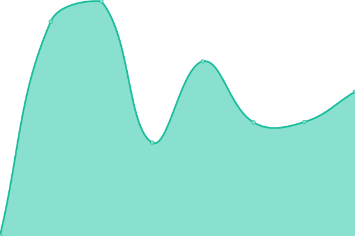
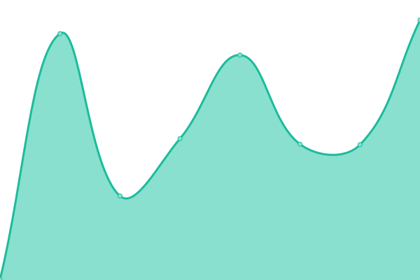
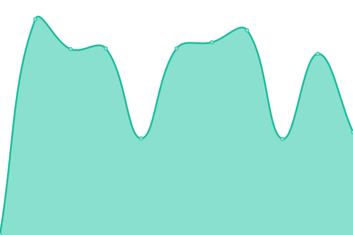
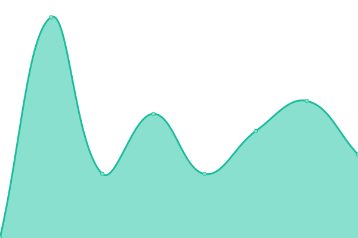

# [📈 Live Status](https://status.sekaisoft.tech): <!--live status--> **🟧 Partial outage**

This repository contains the open-source uptime monitor and status page for [Sekaisoft](https://status.sekaisoft.tech), powered by [Upptime](https://github.com/upptime/upptime).

With [Upptime](https://upptime.js.org), you can get your own unlimited and free uptime monitor and status page, powered entirely by a GitHub repository. We use [Issues](https://github.com/sekai-soft/status/issues) as incident reports, [Actions](https://github.com/sekai-soft/status/actions) as uptime monitors, and [Pages](https://status.sekaisoft.tech) for the status page.

<!--start: status pages-->
<!-- This summary is generated by Upptime (https://github.com/upptime/upptime) -->
<!-- Do not edit this manually, your changes will be overwritten -->
<!-- prettier-ignore -->
| URL | Status | History | Response Time | Uptime |
| --- | ------ | ------- | ------------- | ------ |
|  [Cloud Emoticon Store](https://emoticon.moe/store) | 🟩 Up | [cloud-emoticon-store.yml](https://github.com/sekai-soft/status/commits/HEAD/history/cloud-emoticon-store.yml) | 

 683ms
     
 | 

<a href="https://sekai-soft.github.io/status/history/cloud-emoticon-store">100.00%</a>
    

|  [Galerie](https://galerie-reader.com/) | 🟩 Up | [galerie.yml](https://github.com/sekai-soft/status/commits/HEAD/history/galerie.yml) | 

 232ms
     
 | 

<a href="https://sekai-soft.github.io/status/history/galerie">100.00%</a>
    

|  [Mastodon](https://mastodon.ktachibana.party/health) | 🟥 Down | [mastodon.yml](https://github.com/sekai-soft/status/commits/HEAD/history/mastodon.yml) | 

 264ms
     
 | 

<a href="https://sekai-soft.github.io/status/history/mastodon">30.11%</a>
    

|  [Pill City](https://api.pill.city) | 🟩 Up | [pill-city.yml](https://github.com/sekai-soft/status/commits/HEAD/history/pill-city.yml) | 

 368ms
     
 | 

<a href="https://sekai-soft.github.io/status/history/pill-city">100.00%</a>
    

|  [RSS-lambda](https://rss-lambda.xyz/rss?url=https%3A%2F%2Fwww.youtube.com%2Ffeeds%2Fvideos.xml%3Fchannel_id%3DUCrMjr7dY8syS_m9TdqM-g_Q&op=filter_title_excl_substrs&param=%E6%AF%8F%E6%97%A5&param=%E9%9B%AA%E8%8A%B1) | 🟩 Up | [rss-lambda.yml](https://github.com/sekai-soft/status/commits/HEAD/history/rss-lambda.yml) | 

 395ms
     
 | 

<a href="https://sekai-soft.github.io/status/history/rss-lambda">100.00%</a>
    

|  [RSSHub](https://rsshub.ktachibana.party/) | 🟩 Up | [rss-hub.yml](https://github.com/sekai-soft/status/commits/HEAD/history/rss-hub.yml) | 

 495ms
     
 | 

<a href="https://sekai-soft.github.io/status/history/rss-hub">100.00%</a>
    

<!--end: status pages-->

[**Visit our status website →**](https://status.sekaisoft.tech)

## 📄 License

- Powered by: [Upptime](https://github.com/upptime/upptime)
- Code: [MIT](./LICENSE) © [Anand Chowdhary](https://anandchowdhary.com), supported by [Pabio](https://pabio.com)
- Data in the `./history` directory: [Open Database License](https://opendatacommons.org/licenses/odbl/1-0/)
